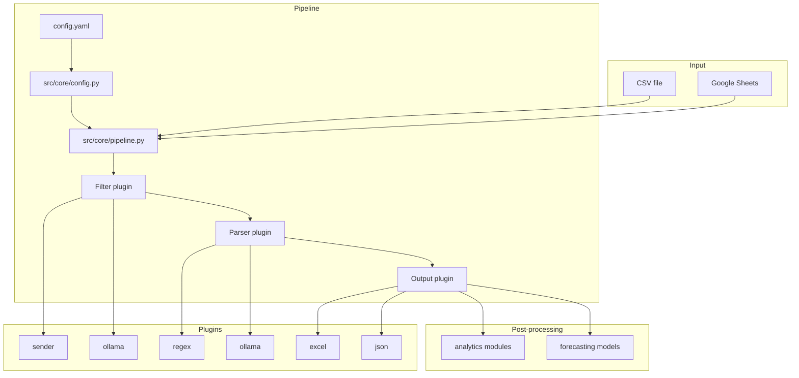

# FinTrack

Personal SMS finance tracker for Bangladesh banks and mobile wallets. FinTrack reads exported phone SMS (CSV or Google Sheets), filters financial messages, parses transactions, and writes a structured ledger to Excel or JSON—with optional analytics and forecasting.

## Features

- **Plugin pipeline** — sources, filters, parsers, and outputs are swappable
- **Fast regex parsing** — NRB Bank, Dhaka Bank, DBBL (`16216`), bKash
- **Optional local AI** — Ollama for classification and parsing when regex is not enough
- **Analytics** — spending, trends, anomaly detection
- **Forecasting** — linear regression or LLM-based predictions
- **Configurable** — `config.yaml` with environment variable expansion

## Requirements

- Python 3.10+
- [Ollama](https://ollama.com) (optional, for AI filter/parser/forecast)

```bash
pip install -r requirements.txt

# Optional: for AI features
ollama pull gemma4:e4b
```

## Quick start

```bash
# Interactive wizard (uses config.yaml defaults)
python -m src.cli.main interactive

# Recommended: fast pipeline with regex parsers
python -m src.cli.main pipeline -s csv -i data.csv -o output.xlsx \
  --filter sender --parser regex

# Analytics on output
python -m src.cli.main analyze output.xlsx -d

# Spending forecast
python -m src.cli.main forecast output.xlsx -m linear -p 3
```

## Architecture

FinTrack uses a linear pipeline orchestrated by `src/core/pipeline.py`. The CLI loads `config.yaml`, merges CLI overrides, and runs each stage through registered plugins.



### Execution paths

| Path | Command | Description |
|------|---------|-------------|
| **Config-driven** | `pipeline`, `interactive` | Loads `config.yaml`; CLI flags override settings |
| **Legacy** | `parse-gsheet` | Regex via `processor.build_rows`; multi-sheet Excel (Summary, Categories, etc.) |

**Override precedence:** CLI flags → `config.yaml` → built-in defaults.

### Project layout

```
src/
├── cli/main.py              # CLI entry point
├── core/
│   ├── config.py            # YAML load, env expansion, CLI merge
│   ├── pipeline.py          # Pipeline orchestrator
│   └── processor.py         # Legacy summarization + parse routing
├── models/
│   ├── ledger.py            # LedgerRow dataclass
│   └── senders.py           # FINANCIAL_SENDERS allowlist
├── parsers/
│   ├── filters/             # sender, ollama
│   ├── implementations/     # regex, ollama (plugin wrappers)
│   ├── nrb.py               # NRB Bank regex
│   ├── dhaka_bank.py        # Dhaka Bank regex
│   ├── dbbl.py              # DBBL regex
│   └── bkash.py             # bKash regex
├── io/sources/              # csv, google_sheets
├── io/outputs/              # excel, json
├── analytics/modules/       # spending, trends, anomaly
├── forecasting/models/      # linear, llm
└── plugins/                 # Plugin registry
```

## Usage

### Pipeline

```bash
python -m src.cli.main pipeline -s csv -i data.csv -o output.xlsx \
  --filter sender --parser regex --analyze --forecast
```

| Flag | Options | Description |
|------|---------|-------------|
| `-s, --source` | `csv`, `google_sheet` | Input source |
| `-i, --input` | path or URL | CSV path or Google Sheet URL |
| `-o, --output` | path | Output file (default: `output.xlsx`) |
| `-c, --credentials` | path | Google service account JSON |
| `--filter` | `none`, `sender`, `ollama` | SMS classifier |
| `--parser` | `none`, `regex`, `ollama` | Transaction parser |
| `--analyze` | flag | Run spending analytics after export |
| `--forecast` | flag | Run forecast after export |

Global option: `--config PATH` — use a custom config file.

### Other commands

```bash
python -m src.cli.main senders              # List enabled/disabled senders
python -m src.cli.main analyze output.xlsx  # Full analytics report
python -m src.cli.main forecast output.xlsx -m llm -p 6
python -m src.cli.main parse-gsheet SHEET_URL -o output.xlsx  # Legacy multi-sheet export
```

### Input format (CSV)

Export SMS from your phone with columns `Date`, `From`, and `Content`:

```csv
Date,From,Empty,Content,Device
"May 24, 2025 at 01:23 PM",NRB Bank,,"NRB Credit Card Bill...",Samsung
```

### Output format (Excel)

| Command | Sheets |
|---------|--------|
| `pipeline` / `interactive` | **Ledger** — one row per parsed transaction |
| `parse-gsheet` | Ledger, Summary, Categories, Account Totals |

Ledger columns include date, amount, merchant, category, direction, balance, transaction ID, and original SMS text.

## Configuration

Edit [`config.yaml`](config.yaml). Environment placeholders are expanded on load:

- `${VAR}` — value from environment, or empty
- `${VAR:-default}` — value from environment, or `default`

```yaml
filters:
  - type: sender
    enabled: true

parsers:
  - type: ollama
    model: gemma4:e4b
    enabled: true
    fallback: regex

sources:
  - type: google_sheets
    sheet_url: "${GOOGLE_SHEET_URL}"
    credentials: "${GOOGLE_CREDENTIALS:-credentials.json}"

analytics:
  enabled: true
```

```bash
export GOOGLE_SHEET_URL="https://docs.google.com/spreadsheets/d/..."
export GOOGLE_CREDENTIALS="credentials.json"
```

For a fully local, fast run without Ollama, enable the regex parser in config:

```yaml
parsers:
  - type: regex
    enabled: true
```

## Filters

| Filter | Speed | Description |
|--------|-------|-------------|
| **sender** | Fast | Uses `FINANCIAL_SENDERS` in `src/models/senders.py` |
| **ollama** | Slow | AI classifies unknown senders; parallel batch with progress |

Edit senders in `src/models/senders.py`:

```python
FINANCIAL_SENDERS = {
    "NRB Bank": True,
    "bKash": True,
    "Robi": False,   # disabled — treated as non-financial
}
```

## Parsers

| Parser | Providers | Notes |
|--------|-----------|-------|
| **regex** | NRB, Dhaka Bank, DBBL (`16216`), bKash | Fast; no Ollama required |
| **ollama** | Any SMS format | Uses local LLM; falls back to regex on failure |

Regex modules live under `src/parsers/` and are routed from `src/core/processor.py` via `parse_raw_row()`.

## Google Sheets

1. Create a Google Cloud service account and download `credentials.json`
2. Share the sheet with the service account email
3. Set `GOOGLE_SHEET_URL` in config or pass `-i` with the sheet URL

```bash
python -m src.cli.main pipeline -s google_sheet \
  -i "https://docs.google.com/spreadsheets/d/SHEET_ID/edit" \
  -c credentials.json -o output.xlsx --filter sender --parser regex
```

## Troubleshooting

**Only NRB transactions in output**  
You are likely using the regex parser, which only parses SMS it has patterns for. Re-run with all regex parsers (default since recent update) or use `--parser ollama` if Ollama is running.

**No transactions parsed**  
Check senders: `python -m src.cli.main senders`. Try `--filter sender` and ensure the CSV has expected `From` values.

**Slow on large exports**  
Use `--filter sender --parser regex`. Avoid the default Ollama parser for thousands of rows.

**Ollama errors**  
```bash
ollama serve
ollama pull gemma4:e4b
```

## Development

See [`CLAUDE.md`](CLAUDE.md) for agent-oriented project notes and [`TODO.md`](TODO.md) for the roadmap.

## License

Private — for personal use only.
